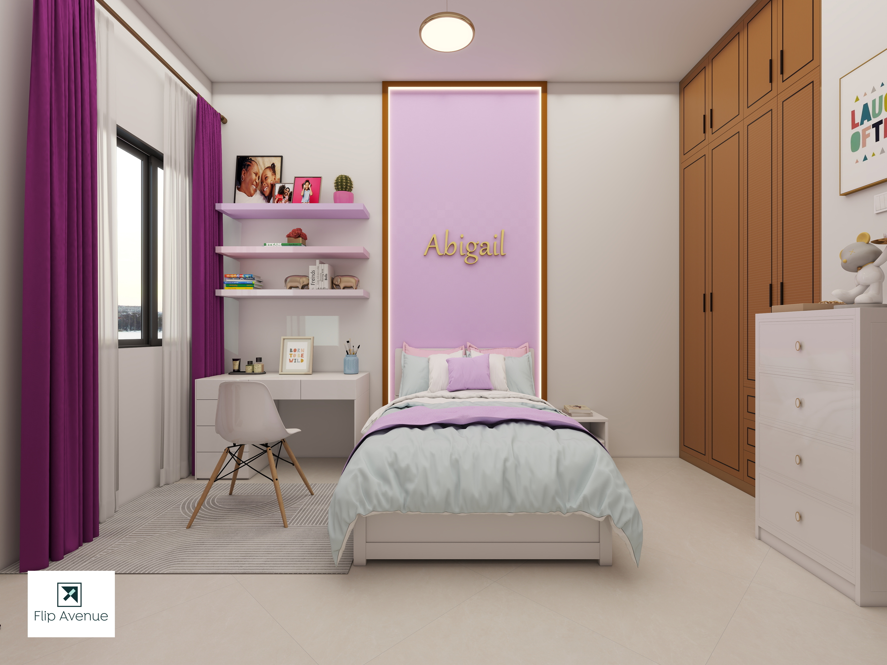

# Homepage (index.php) Conversion Guide

## Status
✅ PHP file created with database queries
⚠️ HTML sections need to be updated to use PHP variables

---

## Database Queries Added

The following data is now being fetched from the database:

```php
✅ Services - LIMIT 4 (active, ordered)
✅ Projects - LIMIT 6 (featured, active, ordered)  
✅ Team Members - LIMIT 6 (active, ordered)
✅ Testimonials - LIMIT 3 (active, ordered)
✅ Awards - LIMIT 4 (active, recent first)
✅ Blog Posts - LIMIT 3 (published, latest)
✅ Site Settings - All settings (associative array)
```

---

## Sections to Convert

### 1. Services Section (Line ~276)
**Current:** Static HTML with hardcoded services
**Convert to:** Dynamic PHP loop

**Before:**
```html
<div class="col-lg-3">
    <a href="#" class="service-card">
        <div class="icon">
            <i class="la la-hard-hat"></i>
        </div>
        <h5 class="fsz-24 mb-20"> Architecture & Building </h5>
        <div class="img">
            
        </div>
        <div class="text color-666 mt-50">
            Planning, 3D Visualization...
        </div>
    </a>
</div>
```

**After:**
```php
<?php if ($services_result && $services_result->num_rows > 0): ?>
    <?php while ($service = $services_result->fetch_assoc()): ?>
        <div class="col-lg-3">
            <a href="#" class="service-card wow fadeInUp">
                <div class="icon">
                    <i class="<?php echo htmlspecialchars($service['icon']); ?>"></i>
                </div>
                <h5 class="fsz-24 mb-20"><?php echo htmlspecialchars($service['title']); ?></h5>
                <?php if ($service['image']): ?>
                    <div class="img">
                        " alt="">
                    </div>
                <?php endif; ?>
                <div class="text color-666 mt-50">
                    <?php echo htmlspecialchars($service['description']); ?>
                </div>
                <span class="arrow"> <i class="ti-arrow-top-right"></i> </span>
            </a>
        </div>
    <?php endwhile; ?>
<?php endif; ?>
```

---

### 2. Featured Projects Section (Line ~432)
**Current:** Static HTML with hardcoded projects
**Convert to:** Dynamic PHP loop

**Before:**
```html
<div class="col-lg-6 mb-50">
    <div class="project-card wow fadeInUp">
        <div class="img">
            
        </div>
        <div class="info">
            <h5> Project Title </h5>
            <p> Category </p>
        </div>
    </div>
</div>
```

**After:**
```php
<?php if ($projects_result && $projects_result->num_rows > 0): ?>
    <?php 
    $delay = 0;
    while ($project = $projects_result->fetch_assoc()): 
    ?>
        <div class="col-lg-6 mb-50">
            <div class="project-card wow fadeInUp" data-wow-delay="<?php echo $delay; ?>s">
                <div class="img">
                    <?php if ($project['featured_image']): ?>
                        " alt="">
                    <?php else: ?>
                        
                    <?php endif; ?>
                </div>
                <div class="info">
                    <h5><?php echo htmlspecialchars($project['title']); ?></h5>
                    <p><?php echo htmlspecialchars($project['category']); ?></p>
                    <?php if ($project['slug']): ?>
                        <a href="project.php?slug=<?php echo $project['slug']; ?>" class="mt-3">
                            View Project <i class="ti-arrow-top-right"></i>
                        </a>
                    <?php endif; ?>
                </div>
            </div>
        </div>
    <?php 
    $delay += 0.1;
    if ($delay > 0.5) $delay = 0;
    endwhile; 
    ?>
<?php endif; ?>
```

---

### 3. Testimonials Section (Line ~619)
**Current:** Static HTML
**Convert to:** Dynamic PHP loop

**After:**
```php
<?php if ($testimonials_result && $testimonials_result->num_rows > 0): ?>
    <div class="swiper-wrapper">
        <?php while ($testimonial = $testimonials_result->fetch_assoc()): ?>
            <div class="swiper-slide">
                <div class="testimonial-card">
                    <div class="stars mb-30">
                        <?php for ($i = 0; $i < $testimonial['rating']; $i++): ?>
                            <i class="la la-star"></i>
                        <?php endfor; ?>
                    </div>
                    <div class="text fsz-20 mb-40">
                        "<?php echo htmlspecialchars($testimonial['testimonial_text']); ?>"
                    </div>
                    <div class="author">
                        <?php if ($testimonial['client_photo']): ?>
                            <div class="img">
                                " alt="">
                            </div>
                        <?php endif; ?>
                        <div class="info">
                            <h6><?php echo htmlspecialchars($testimonial['client_name']); ?></h6>
                            <p><?php echo htmlspecialchars($testimonial['client_position']); ?></p>
                            <?php if ($testimonial['client_company']): ?>
                                <p><?php echo htmlspecialchars($testimonial['client_company']); ?></p>
                            <?php endif; ?>
                        </div>
                    </div>
                </div>
            </div>
        <?php endwhile; ?>
    </div>
<?php endif; ?>
```

---

### 4. Awards Section (Line ~687)
**Current:** Static HTML
**Convert to:** Dynamic PHP loop

**After:**
```php
<?php if ($awards_result && $awards_result->num_rows > 0): ?>
    <?php while ($award = $awards_result->fetch_assoc()): ?>
        <div class="award-card wow fadeInUp">
            <div class="num"><?php echo $award['year']; ?></div>
            <div class="info">
                <h6><?php echo htmlspecialchars($award['title']); ?></h6>
                <?php if ($award['organization']): ?>
                    <p><?php echo htmlspecialchars($award['organization']); ?></p>
                <?php endif; ?>
                <?php if ($award['description']): ?>
                    <p class="text-muted"><?php echo htmlspecialchars($award['description']); ?></p>
                <?php endif; ?>
            </div>
        </div>
    <?php endwhile; ?>
<?php endif; ?>
```

---

### 5. Team Section (Line ~723)
**Current:** Static HTML
**Convert to:** Dynamic PHP loop

**After:**
```php
<?php if ($team_result && $team_result->num_rows > 0): ?>
    <?php 
    $delay = 0;
    while ($member = $team_result->fetch_assoc()): 
    ?>
        <div class="col-lg-4 col-md-6 mb-50">
            <div class="team-card wow fadeInUp" data-wow-delay="<?php echo $delay; ?>s">
                <div class="img">
                    <?php if ($member['photo']): ?>
                        " alt="">
                    <?php else: ?>
                        
                    <?php endif; ?>
                </div>
                <div class="info">
                    <h6><?php echo htmlspecialchars($member['full_name']); ?></h6>
                    <p><?php echo htmlspecialchars($member['position']); ?></p>
                    <?php if ($member['social_links']): ?>
                        <?php $socials = json_decode($member['social_links'], true); ?>
                        <div class="social-links mt-3">
                            <?php if (isset($socials['linkedin'])): ?>
                                <a href="<?php echo $socials['linkedin']; ?>"><i class="fab fa-linkedin"></i></a>
                            <?php endif; ?>
                            <?php if (isset($socials['twitter'])): ?>
                                <a href="<?php echo $socials['twitter']; ?>"><i class="fab fa-twitter"></i></a>
                            <?php endif; ?>
                        </div>
                    <?php endif; ?>
                </div>
            </div>
        </div>
    <?php 
    $delay += 0.1;
    if ($delay > 0.5) $delay = 0;
    endwhile; 
    ?>
<?php endif; ?>
```

---

### 6. Blog Section (Line ~827)
**Current:** Static HTML
**Convert to:** Dynamic PHP loop

**After:**
```php
<?php if ($blog_result && $blog_result->num_rows > 0): ?>
    <?php 
    $delay = 0;
    while ($post = $blog_result->fetch_assoc()): 
    ?>
        <div class="col-lg-4 col-md-6 mb-50">
            <div class="blog-card wow fadeInUp" data-wow-delay="<?php echo $delay; ?>s">
                <div class="img mb-3">
                    <a href="single.php?slug=<?php echo $post['slug']; ?>">
                        <?php if ($post['featured_image']): ?>
                            " alt="" class="img-cover">
                        <?php else: ?>
                            
                        <?php endif; ?>
                    </a>
                </div>
                <div class="info">
                    <div class="date mb-3">
                        <div class="num fsz-35 fw-600 color-orange1">
                            <?php echo date('d', strtotime($post['publish_date'])); ?>
                        </div>
                        <small class="fsz-12 text-uppercase color-666">
                            <?php echo date('F Y', strtotime($post['publish_date'])); ?>
                        </small>
                    </div>
                    <div class="cont">
                        <a href="single.php?slug=<?php echo $post['slug']; ?>" class="title d-block fsz-20 hover-orange1 mb-15 fw-600">
                            <?php echo htmlspecialchars($post['title']); ?>
                        </a>
                        <?php if ($post['category']): ?>
                            <small class="fsz-12 color-orange1 mb-3 d-block">
                                <i class="la la-tag me-1"></i>
                                <?php echo htmlspecialchars($post['category']); ?>
                            </small>
                        <?php endif; ?>
                        <p class="text color-666 fsz-14 mb-15">
                            <?php echo htmlspecialchars(substr(strip_tags($post['excerpt'] ?: $post['content']), 0, 120)) . '...'; ?>
                        </p>
                        <a href="single.php?slug=<?php echo $post['slug']; ?>" class="read-more fsz-14 color-000 fw-500">
                            Read Article <i class="la la-arrow-right ms-1"></i>
                        </a>
                    </div>
                </div>
            </div>
        </div>
    <?php 
    $delay += 0.1;
    if ($delay > 0.5) $delay = 0;
    endwhile; 
    ?>
<?php endif; ?>
```

---

## Implementation Steps

### Quick Implementation (Current approach):
1. ✅ Add PHP database queries at top
2. ⚠️ Keep static HTML for now
3. ⚠️ Gradual section-by-section conversion

### Full Implementation (Recommended):
1. Replace each static section with PHP loops
2. Add fallback content if no data exists
3. Test each section individually
4. Ensure WOW animations still work
5. Verify image paths are correct

---

## Benefits of Full Conversion

### Content Management:
- ✅ Update services from CMS
- ✅ Manage featured projects
- ✅ Add/remove team members
- ✅ Update testimonials
- ✅ Track awards
- ✅ Auto-show latest blog posts

### Performance:
- ✅ Fresh content on every load
- ✅ No need to edit HTML
- ✅ Consistent data across pages
- ✅ Easy to maintain

### SEO:
- ✅ Dynamic meta tags
- ✅ Fresh content signals
- ✅ Structured data ready
- ✅ Auto-updated sitemaps

---

## Testing Checklist

After conversion, test:
- [ ] Services display correctly
- [ ] Project images load
- [ ] Team photos visible
- [ ] Testimonials show properly
- [ ] Awards list correctly
- [ ] Blog posts display
- [ ] WOW animations work
- [ ] Links function properly
- [ ] Responsive on mobile
- [ ] No PHP errors

---

## Note

The index.php file now has all the necessary database queries at the top. To fully integrate, each HTML section needs to be manually converted to use the PHP variables as shown in the examples above.

This is a gradual process that can be done section by section to avoid breaking the site.

